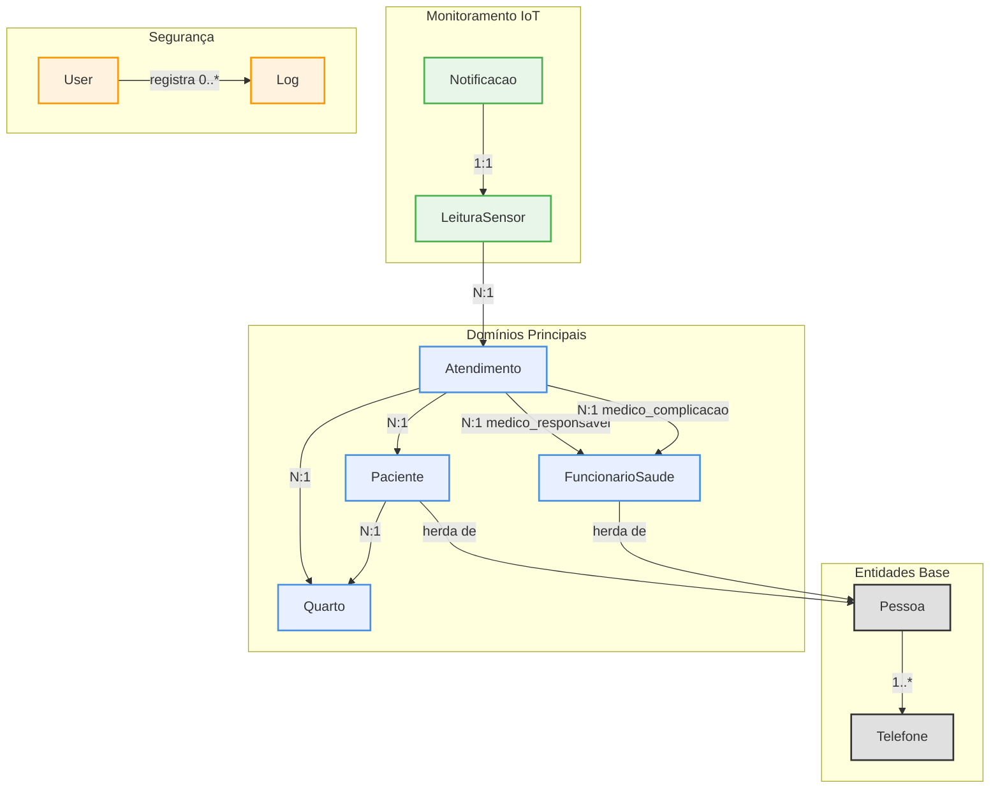
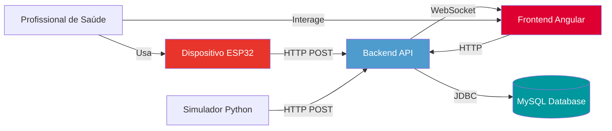
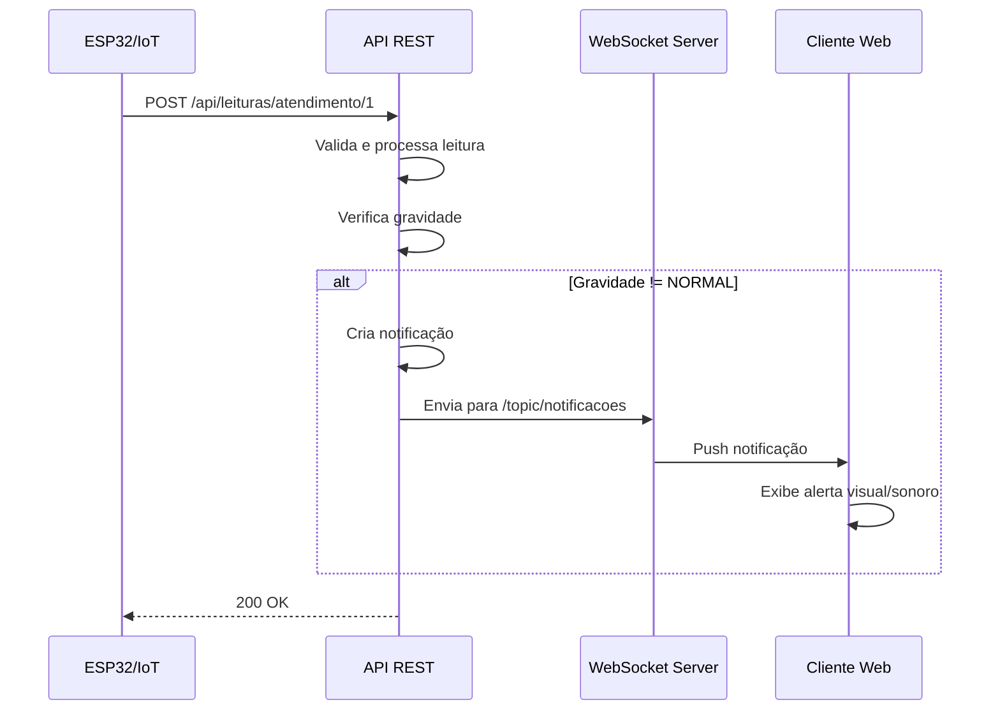

# InfraMed - API de Monitoramento de Pacientes

**API RESTful robusta para gestão hospitalar e monitoramento de pacientes em tempo real, construída com arquitetura moderna e as melhores práticas de desenvolvimento.**

---

<p align="center">
  
  
  
  
  
  
</p>

---

## 📋 Sumário

- [📖 Sobre o Projeto](#-sobre-o-projeto)
- [✨ Principais Funcionalidades](#-principais-funcionalidades)
- [🛠️ Tecnologias e Justificativas](#️-tecnologias-e-justificativas)
- [🏗️ Arquitetura do Sistema](#️-arquitetura-do-sistema)
- [🛡️ Qualidade de Código e Segurança](#️-qualidade-de-código-e-segurança)
- [🚀 Como Executar o Backend](#-como-executar-o-backend)
- [🔧 Configuração do ESP (Dispositivo IoT)](#-configuração-do-esp-dispositivo-iot)
- [🌐 Ecossistema Completo](#-ecossistema-completo)
- [📄 Endpoints da API](#-endpoints-da-api)
- [🗄️ Estrutura de Banco de Dados](#️-estrutura-de-banco-de-dados)
- [🔌 WebSocket e Comunicação em Tempo Real](#-websocket-e-comunicação-em-tempo-real)
- [💡 Contexto do Projeto](#-contexto-do-projeto)
- [✍️ Autor](#️-autor)

---

## 📖 Sobre o Projeto

O **InfraMed** é um sistema backend projetado para otimizar a gestão de hospitais, reduzir a sobrecarga das equipes de saúde e agilizar o atendimento. A API RESTful permite gerenciar de forma eficiente os dados de quartos, pacientes, atendimentos e funcionários, criando um ambiente hospitalar mais seguro e centrado no paciente.

Com uma arquitetura moderna e princípios sólidos de engenharia de software, o InfraMed serve como uma base tecnológica que devolve tempo aos profissionais e tranquilidade aos pacientes.

### 🎯 Objetivos

- **Centralizar informações**: Gestão unificada de pacientes, atendimentos e recursos hospitalares
- **Monitoramento em tempo real**: Coleta e análise de sinais vitais através de dispositivos IoT
- **Alertas inteligentes**: Sistema de notificações com lógica anti-fadiga de alarmes
- **Segurança robusta**: Autenticação JWT e autorização baseada em roles
- **Comunicação bidirecional**: WebSocket para atualizações em tempo real
- **Rastreabilidade completa**: Sistema de logs para auditoria de todas as operações

---

## ✨ Principais Funcionalidades

### Gestão Completa
- **CRUD de Pacientes**: Cadastro, consulta, atualização e remoção com validação de CPF
- **CRUD de Funcionários**: Gerenciamento de médicos, enfermeiros e equipe de saúde
- **CRUD de Quartos**: Controle de capacidade e alocação de pacientes
- **CRUD de Atendimentos**: Registro de internações com médico responsável e diagnósticos (CID-10)

### Monitoramento IoT
- **Coleta de Dados**: Recepção de leituras de sensores (temperatura, frequência cardíaca, pressão arterial)
- **Classificação Automática**: Análise de gravidade (NORMAL, ALERTA, EMERGENCIAL)
- **Histórico Completo**: Armazenamento de todas as leituras por atendimento

### Sistema de Notificações Inteligente
- **Alertas Contextualizados**: Notificações baseadas na gravidade das leituras
- **Anti-Fadiga de Alarmes**: Supressão de alertas repetidos do mesmo tipo
- **Status de Atendimento**: Rastreamento de notificações (ABERTA, EM_ATENDIMENTO, FECHADA)
- **WebSocket Push**: Envio imediato de alertas para clientes conectados

### Segurança e Autenticação
- **JWT com Refresh Token**: Access token (15 min) e Refresh token (7 dias)
- **Autorização Granular**: 6 níveis de permissão (ADMIN, MEDICO, ENFERMEIRO, etc.)
- **Logs de Auditoria**: Registro de todas as ações dos usuários
- **Senhas Criptografadas**: BCrypt para armazenamento seguro

### Comunicação em Tempo Real
- **WebSocket STOMP**: Conexões bidirecionais para updates instantâneos
- **Canais Privados**: Mensagens direcionadas por usuário (/queue)
- **Broadcast**: Notificações globais (/topic)
- **Autenticação WS**: Token JWT no handshake do WebSocket

---

## 🛠️ Tecnologias e Justificativas

### Backend Core
- **Java 24**: Versão mais recente com melhorias de performance e recursos modernos
- **Spring Boot 3.4.5**: Framework principal com auto-configuração e produtividade
- **Spring Data JPA**: Abstração do acesso a dados com repositórios
- **Hibernate**: ORM para mapeamento objeto-relacional
- **Spring Security**: Framework de segurança com suporte a JWT
- **Maven 4.0.0**: Gerenciamento de dependências e build

### Comunicação e Tempo Real
- **Spring WebSocket**: Suporte a WebSocket com protocolo STOMP
- **SockJS**: Fallback para navegadores sem suporte a WebSocket nativo
- **Jackson**: Serialização/deserialização JSON

### Segurança e Autenticação
- **JWT (auth0)**: Tokens assinados para autenticação stateless
- **BCrypt**: Algoritmo de hash para senhas
- **Spring Security**: Filtros de segurança e autorização

### Qualidade e Produtividade
- **Lombok**: Redução de boilerplate (getters, setters, builders)
- **MapStruct**: Mapeamento automático entre DTOs e entidades
- **Jakarta Validation**: Validação declarativa de dados
- **Hibernate Validator**: Implementação de Bean Validation

### Banco de Dados
- **MySQL 8.0**: Banco relacional robusto e escalável
- **Flyway/Liquibase Ready**: Estrutura preparada para migrações

### Documentação
- **Springdoc OpenAPI 3**: Documentação interativa (Swagger UI)
- **Annotations**: Documentação inline dos endpoints

---

## 🏗️ Arquitetura do Sistema

O projeto adota uma **arquitetura em camadas** com princípios de **Domain-Driven Design (DDD)**, **SOLID** e **Clean Architecture**.

### Estrutura de Camadas

```
┌─────────────────────────────────────────────────┐
│   Controllers (REST + WebSocket)               │
│   - Recepção de requisições HTTP/WS            │
│   - Validação inicial                           │
└─────────────────────────────────────────────────┘
                      ↓
┌─────────────────────────────────────────────────┐
│   Services (Lógica de Negócio)                 │
│   - Regras de validação                         │
│   - Orquestração de operações                   │
│   - Processamento de dados                      │
└─────────────────────────────────────────────────┘
                      ↓
┌─────────────────────────────────────────────────┐
│   Repositories (Acesso a Dados)                │
│   - Persistência via JPA                        │
│   - Queries customizadas                        │
└─────────────────────────────────────────────────┘
                      ↓
┌─────────────────────────────────────────────────┐
│   Database (MySQL)                              │
│   - Armazenamento persistente                   │
└─────────────────────────────────────────────────┘
```

### Organização por Domínios

```
src/main/java/com/springwalker/back/
├── atendimento/          # Domínio de Atendimentos
│   ├── controller/
│   ├── service/
│   ├── repository/
│   ├── model/
│   ├── dto/
│   ├── mapper/
│   └── enums/
├── paciente/             # Domínio de Pacientes
├── funcionario/          # Domínio de Funcionários
├── quarto/               # Domínio de Quartos
├── monitoramento/        # Domínio de IoT e Sensores
│   ├── controller/
│   ├── service/
│   │   ├── leitura/
│   │   └── notificacao/
│   ├── model/
│   └── dto/
├── user/                 # Domínio de Usuários
├── core/                 # Componentes transversais
│   ├── auth/            # Autenticação JWT
│   ├── config/          # Configurações
│   │   └── security/
│   ├── handler/         # Tratamento de exceções
│   └── log/             # Sistema de logs
└── pessoa/              # Classe base abstrata
```

### Diagrama de Entidades



### Princípios Arquiteturais Aplicados

- **Single Responsibility**: Cada service tem uma responsabilidade única (Criar, Buscar, Alterar, Deletar)
- **Open/Closed**: Extensível através de herança (Pessoa → Paciente/FuncionarioSaude)
- **Dependency Inversion**: Controllers dependem de abstrações (interfaces dos services)
- **Interface Segregation**: DTOs específicos para Request e Response
- **Domain-Driven Design**: Organização por domínios de negócio
- **Separation of Concerns**: Camadas bem definidas sem acoplamento

---

## 🛡️ Qualidade de Código e Segurança

### Práticas de Qualidade

- **Código Limpo**: Nomenclatura clara e métodos com responsabilidade única
- **Imutabilidade**: Uso de records para DTOs
- **Validação em Camadas**: Jakarta Validation nos DTOs + regras de negócio nos services
- **Tratamento de Exceções**: GlobalExceptionHandler centralizado
- **Logs Estruturados**: Registro de eventos importantes com contexto

### Segurança Implementada

- **Autenticação JWT**: Tokens assinados com algoritmo HMAC256
- **Autorização Baseada em Roles**: 6 níveis de permissão
- **CORS Configurável**: Controle de origens permitidas
- **Senhas Criptografadas**: BCrypt com salt automático
- **Proteção CSRF**: Desabilitado por ser API stateless (documentado no código)
- **Rate Limiting Ready**: Estrutura preparada para implementação
- **SQL Injection**: Prevenção via PreparedStatements (JPA)
- **Validação de Entrada**: Todas as requisições validadas

### Validações de Negócio

- **Pacientes**: CPF único, quarto com capacidade disponível
- **Atendimentos**: Apenas um atendimento aberto por paciente, médico responsável obrigatório
- **Quartos**: Controle de capacidade, prevenção de duplicação de pacientes
- **Notificações**: Lógica anti-fadiga de alarmes (um alerta por tipo/atendimento)

---

## 🚀 Como Executar o Backend

### Pré-requisitos

- **JDK 24** ou superior ([Download](https://www.oracle.com/java/technologies/downloads/))
- **Maven 4.0.0** ([Download](https://maven.apache.org/download.cgi))
- **MySQL 8.0** ([Download](https://dev.mysql.com/downloads/))
- **Git** ([Download](https://git-scm.com/downloads))

### Passo a Passo

1. **Clone o repositório:**
   ```bash
   git clone https://github.com/matheus05dev/BackendMonitoramentoPacientes
   cd BackendMonitoramentoPacientes
   ```

2. **Configure o banco de dados MySQL:**
   
   Crie o banco de dados:
   ```sql
   CREATE DATABASE InfraMedDB;
   ```

3. **Configure o arquivo `application.properties`:**
   
   Edite o arquivo em `src/main/resources/application.properties`:
   
   ```properties
   # Database Configuration
   spring.datasource.url=jdbc:mysql://localhost:3306/InfraMedDB?createDatabaseIfNotExist=true
   spring.datasource.username=root
   spring.datasource.password=sua_senha_aqui
   spring.datasource.driver-class-name=com.mysql.cj.jdbc.Driver

   # JPA/Hibernate Configuration
   spring.jpa.generate-ddl=true
   spring.jpa.hibernate.ddl-auto=update
   spring.jpa.show-sql=true
   spring.jpa.properties.hibernate.globally_quoted_identifiers=true
   spring.jpa.properties.hibernate.globally_quoted_identifiers_skip_column_definitions=true

   # Server Port
   server.port=8080

   # Locale Configuration
   spring.jackson.locale=pt_BR
   spring.jackson.time-zone=America/Sao_Paulo
   ```

4. **Compile e execute a aplicação:**
   ```bash
   # Limpar e compilar
   mvn clean install

   # Executar
   mvn spring-boot:run
   ```

   Ou execute o JAR diretamente:
   ```bash
   java -jar target/inframed-api-1.0.0.jar
   ```

5. **Verifique se está rodando:**
   - **API Base**: http://localhost:8080
   - **Swagger UI**: http://localhost:8080/swagger-ui/index.html
   - **WebSocket**: ws://localhost:8080/ws

### Usuário Padrão

O sistema cria automaticamente um usuário administrador na primeira execução:

- **Username**: `admin`
- **Password**: `admin`
- **Role**: `ADMIN`

⚠️ **IMPORTANTE**: Altere essa senha em produção!

### Testando a API

Use o Swagger UI ou ferramentas como Postman/Insomnia:

1. **Login** (POST `/api/auth/login`):
   ```json
   {
     "login": "admin",
     "senha": "admin"
   }
   ```

2. **Copie o accessToken** da resposta

3. **Use o token** nas requisições seguintes:
   ```
   Authorization: Bearer seu_token_aqui
   ```

---

## 🔧 Configuração do ESP (Dispositivo IoT)

Para integrar dispositivos IoT (como ESP32) com a API, existem duas abordagens:

### 1. Configuração de CORS (Recomendado para Desenvolvimento)

Edite o arquivo `src/main/java/com/springwalker/back/core/config/CorsConfig.java`:

```java
@Bean
public CorsConfigurationSource corsConfigurationSource() {
    CorsConfiguration configuration = new CorsConfiguration();
    configuration.setAllowedOrigins(List.of(
        "http://localhost:4200",      // Frontend Angular
        "http://192.168.1.11"         // Endereço IP do ESP32
    ));
    configuration.setAllowedMethods(List.of("GET", "POST", "PUT", "PATCH", "DELETE", "OPTIONS"));
    configuration.setAllowedHeaders(List.of("*"));
    configuration.setAllowCredentials(true);
    
    UrlBasedCorsConfigurationSource source = new UrlBasedCorsConfigurationSource();
    source.registerCorsConfiguration("/**", configuration);
    return source;
}
```

### 2. Configuração de Rede

Garanta que o ESP e a API estejam na mesma rede local:

**No código do ESP32:**
```cpp
const char* serverUrl = "http://192.168.1.100:8080/api/leituras/atendimento/1";

HTTPClient http;
http.begin(serverUrl);
http.addHeader("Content-Type", "application/json");

// Corpo da requisição
String jsonPayload = "{\"valor\":36.5,\"dataHora\":\"2024-12-19T10:30:00\",\"tipoDado\":\"TEMPERATURA\",\"unidadeMedida\":\"CELSIUS\"}";

int httpResponseCode = http.POST(jsonPayload);
```

### Endpoints Públicos para IoT

Os seguintes endpoints **não requerem autenticação** para facilitar a integração com dispositivos IoT:

- **POST** `/api/leituras/atendimento/{atendimentoId}` - Enviar leitura de sensor
- **GET** `/api/leituras/atendimento/{atendimentoId}` - Consultar leituras (requer autenticação em produção)

### Exemplo de Payload de Leitura

```json
{
  "valor": 75.0,
  "dataHora": "2024-12-19T10:30:00",
  "tipoDado": "FREQUENCIA_CARDIACA",
  "unidadeMedida": "BPM",
  "condicaoSaude": "NORMAL",
  "gravidade": "NORMAL"
}
```

---

## 🌐 Ecossistema Completo

O InfraMed faz parte de um ecossistema integrado para gestão hospitalar completa.

### Repositórios do Projeto

| Componente | Tecnologia | Repositório | Descrição |
|------------|-----------|-------------|-----------|
| **Backend** | Spring Boot + MySQL | [BackendMonitoramentoPacientes](https://github.com/matheus05dev/BackendMonitoramentoPacientes) | Este repositório - API RESTful para gestão hospitalar |
| **Frontend** | Angular | [FrontendMonitoramentoPacientes](https://github.com/matheus05dev/FrontendMonitoramentoPacientes) | Interface web para profissionais de saúde |
| **IoT Device** | ESP32 + Arduino | [IoTMonitoramentoPacientes](https://github.com/matheus05dev/IoTMonitoramentoPacientes) | Dispositivo de monitoramento de sinais vitais |
| **Simulador IoT** | Python | [SimuladorIoTMonitoramentoPacientes](https://github.com/matheus05dev/SimuladorIoTMonitoramentoPacientes) | Simulador para testes sem hardware físico |

### Fluxo de Dados no Ecossistema



### Como Integrar Todos os Componentes

#### 1. Backend (Obrigatório - Este repositório)
```bash
# Clone e inicie
git clone https://github.com/matheus05dev/BackendMonitoramentoPacientes
cd BackendMonitoramentoPacientes
mvn spring-boot:run
```
**Acesse:** `http://localhost:8080`

#### 2. Frontend (Opcional - para visualização web)
```bash
# Clone e inicie
git clone https://github.com/matheus05dev/FrontendMonitoramentoPacientes
cd FrontendMonitoramentoPacientes
npm install
ng serve
```
**Acesse:** `http://localhost:4200`

#### 3. IoT Device (Opcional - para dispositivo físico)
```bash
# Clone e configure
git clone https://github.com/matheus05dev/IoTMonitoramentoPacientes
cd IoTMonitoramentoPacientes
# Siga as instruções no README do repositório
```

#### 4. Simulador Python (Opcional - para testes sem hardware)
```bash
# Clone e execute
git clone https://github.com/matheus05dev/SimuladorIoTMonitoramentoPacientes
cd SimuladorIoTMonitoramentoPacientes
pip install -r requirements.txt
python simulador.py
```

---

## 📄 Endpoints da API

### Perfis de Usuário (Roles)

| Role | Descrição | Endpoints Acessíveis |
|------|-----------|---------------------|
| `ADMIN` | Acesso total ao sistema | Todos |
| `MEDICO` | Acesso médico completo | Criação de atendimentos, consultas |
| `ENFERMEIRO` | Gestão de pacientes e quartos | CRUD pacientes, alocação quartos |
| `AUXILIAR_ENFERMAGEM` | Suporte operacional | Consultas, operações básicas |
| `TECNICO_ENFERMAGEM` | Tarefas técnicas | Consultas, monitoramento |
| `ESTAGIARIO` | Acesso somente leitura | Apenas consultas (GET) |

### 🔐 Autenticação

**Base URL**: `/api/auth`

| Método | Endpoint | Descrição | Autenticação |
|--------|----------|-----------|--------------|
| POST | `/login` | Autentica usuário e retorna tokens | Pública |
| POST | `/refresh` | Renova access token | Pública |
| POST | `/logout` | Efetua logout | Requer token |

**Exemplo de Login:**
```json
// Request
POST /api/auth/login
{
  "login": "admin",
  "senha": "admin"
}

// Response
{
  "accessToken": "eyJhbGciOiJIUzI1NiIs...",
  "refreshToken": "eyJhbGciOiJIUzI1NiIs..."
}
```

### 👤 Pacientes

**Base URL**: `/api/pacientes`

| Método | Endpoint | Descrição | Roles |
|--------|----------|-----------|-------|
| POST | `/` | Criar paciente | ADMIN, MEDICO, ENFERMEIRO |
| GET | `/` | Listar todos | Todos autenticados |
| GET | `/id/{id}` | Buscar por ID | Todos autenticados |
| GET | `/cpf/{cpf}` | Buscar por CPF | Todos autenticados |
| GET | `/nome/{nome}` | Buscar por nome | Todos autenticados |
| PUT | `/{id}` | Atualizar paciente | ADMIN, MEDICO, ENFERMEIRO |
| DELETE | `/{id}` | Deletar paciente | ADMIN |

**Exemplo de Criação:**
```json
POST /api/pacientes
{
  "nome": "João Silva",
  "email": "joao@email.com",
  "sexo": "Masculino",
  "dataNascimento": "1990-05-15",
  "cpf": "123.456.789-00",
  "telefones": [
    {"DDD": 11, "numero": "98765-4321"}
  ],
  "alergias": ["Penicilina"],
  "quartoId": 1
}
```

### 👨‍⚕️ Funcionários

**Base URL**: `/api/funcionario`

| Método | Endpoint | Descrição | Roles |
|--------|----------|-----------|-------|
| POST | `/` | Criar funcionário | ADMIN |
| GET | `/` | Listar todos | Todos autenticados |
| GET | `/{id}` | Buscar por ID | Todos autenticados |
| GET | `/buscar-por-nome/{nome}` | Buscar por nome | Todos autenticados |
| GET | `/buscar-por-cpf/{cpf}` | Buscar por CPF | Todos autenticados |
| PUT | `/{id}` | Atualizar funcionário | ADMIN |
| DELETE | `/{id}` | Deletar funcionário | ADMIN |

### 🏥 Quartos

**Base URL**: `/api/quarto`

| Método | Endpoint | Descrição | Roles |
|--------|----------|-----------|-------|
| POST | `/` | Criar quarto | ADMIN |
| POST | `/inserir-varios` | Criar múltiplos quartos | ADMIN |
| GET | `/` | Listar todos | Todos autenticados |
| GET | `/{id}` | Buscar por ID | Todos autenticados |
| PUT | `/{id}` | Atualizar quarto | ADMIN |
| PUT | `/{quartoId}/alocar-paciente/{pacienteId}` | Alocar paciente | ADMIN, MEDICO, ENFERMEIRO |
| PUT | `/{quartoId}/remover-paciente/{pacienteId}` | Remover paciente | ADMIN, MEDICO, ENFERMEIRO |
| DELETE | `/{id}` | Deletar quarto | ADMIN |

### 📋 Atendimentos

**Base URL**: `/api/atendimento`

| Método | Endpoint | Descrição | Roles |
|--------|----------|-----------|-------|
| POST | `/` | Criar atendimento | ADMIN, MEDICO |
| GET | `/` | Listar todos | Todos autenticados |
| GET | `/{id}` | Buscar por ID | Todos autenticados |
| PUT | `/{id}` | Atualizar atendimento | ADMIN, MEDICO |
| DELETE | `/{id}` | Deletar atendimento | ADMIN |

**Diagnósticos Suportados (CID-10):**
- A41 - Septicemia
- J15 - Pneumonia bacteriana
- J96 - Insuficiência respiratória
- S06 - Traumatismo intracraniano
- ... e mais 50+ códigos CID-10

### 📊 Leituras de Sensores

**Base URL**: `/api/leituras`

| Método | Endpoint | Descrição | Autenticação |
|--------|----------|-----------|--------------|
| POST | `/atendimento/{atendimentoId}` | Enviar leitura | **Pública** |
| GET | `/atendimento/{atendimentoId}` | Listar leituras | Requerida |
| GET | `/` | Listar todas | Requerida |

**Tipos de Dados Suportados:**
- `TEMPERATURA` (°C)
- `FREQUENCIA_CARDIACA` (bpm)
- `PRESSAO_ARTERIAL` (mmHg)
- `MEDICACAO` (g)

**Níveis de Gravidade:**
- `NORMAL` - Valores dentro da normalidade
- `ALERTA` - Valores que requerem atenção
- `EMERGENCIAL` - Situação crítica

### 🔔 Notificações

**Base URL**: `/api/notificacoes`

| Método | Endpoint | Descrição | Roles |
|--------|----------|-----------|-------|
| GET | `/` | Listar todas | Todos autenticados |
| GET | `/?status=ABERTA` | Filtrar por status | Todos autenticados |
| PUT | `/{id}/fechar` | Fechar notificação | Todos exceto ESTAGIARIO |

**Status de Notificações:**
- `ABERTA` - Aguardando atendimento
- `EM_ATENDIMENTO` - Sendo tratada
- `FECHADA` - Resolvida
- `PENDENTE` - Aguardando informações

### 👥 Usuários

**Base URL**: `/api/users`

| Método | Endpoint | Descrição | Roles |
|--------|----------|-----------|-------|
| POST | `/` | Criar usuário | ADMIN |
| GET | `/` | Listar todos | ADMIN |
| GET | `/id/{id}` | Buscar por ID | ADMIN |
| GET | `/username/{username}` | Buscar por username | ADMIN |
| PUT | `/{id}` | Atualizar usuário | ADMIN |
| DELETE | `/{id}` | Deletar usuário | ADMIN |

### 📝 Logs

**Base URL**: `/logs`

| Método | Endpoint | Descrição | Roles |
|--------|----------|-----------|-------|
| GET | `/` | Listar todos os logs | ADMIN |

### Códigos de Status HTTP

| Código | Significado | Quando Ocorre |
|--------|------------|---------------|
| 200 | OK | Operação bem-sucedida |
| 201 | Created | Recurso criado com sucesso |
| 204 | No Content | Deleção bem-sucedida |
| 400 | Bad Request | Dados inválidos ou CPF duplicado |
| 401 | Unauthorized | Token ausente ou inválido |
| 403 | Forbidden | Usuário sem permissão |
| 404 | Not Found | Recurso não encontrado |
| 409 | Conflict | Conflito de estado (ex: paciente já internado) |
| 500 | Internal Server Error | Erro interno do servidor |

---

## 🗄️ Estrutura de Banco de Dados

### Principais Entidades

```sql
-- Pessoa (Superclasse)
CREATE TABLE pessoa (
    id BIGINT AUTO_INCREMENT PRIMARY KEY,
    nome VARCHAR(255),
    email VARCHAR(255) UNIQUE,
    sexo VARCHAR(50),
    data_nascimento DATE,
    cpf VARCHAR(14) UNIQUE
);

-- Paciente (Subclasse)
CREATE TABLE paciente (
    id BIGINT PRIMARY KEY,
    quarto_id BIGINT,
    FOREIGN KEY (id) REFERENCES pessoa(id),
    FOREIGN KEY (quarto_id) REFERENCES quarto(id)
);

-- Funcionário de Saúde (Subclasse)
CREATE TABLE funcionario_saude (
    id BIGINT PRIMARY KEY,
    cargo VARCHAR(50),
    identificacao VARCHAR(255) UNIQUE,
    FOREIGN KEY (id) REFERENCES pessoa(id)
);

-- Quarto
CREATE TABLE quarto (
    id BIGINT AUTO_INCREMENT PRIMARY KEY,
    numero INT UNIQUE,
    localizacao VARCHAR(50),
    tipo VARCHAR(50),
    capacidade INT
);

-- Atendimento
CREATE TABLE atendimento (
    id BIGINT AUTO_INCREMENT PRIMARY KEY,
    paciente_id BIGINT,
    medico_responsavel_id BIGINT,
    medico_complicacao_id BIGINT,
    quarto_id BIGINT,
    status_paciente VARCHAR(50),
    status_monitoramento VARCHAR(50),
    diagnostico VARCHAR(100),
    tratamento TEXT,
    data_entrada DATETIME,
    data_saida DATETIME,
    nome_paciente VARCHAR(255),
    nome_medico_responsavel VARCHAR(255),
    numero_quarto INT,
    FOREIGN KEY (paciente_id) REFERENCES paciente(id),
    FOREIGN KEY (medico_responsavel_id) REFERENCES funcionario_saude(id),
    FOREIGN KEY (medico_complicacao_id) REFERENCES funcionario_saude(id),
    FOREIGN KEY (quarto_id) REFERENCES quarto(id)
);

-- Leitura de Sensor
CREATE TABLE leitura_sensor (
    id BIGINT AUTO_INCREMENT PRIMARY KEY,
    atendimento_id BIGINT NOT NULL,
    valor DOUBLE,
    data_hora DATETIME,
    tipo_dado VARCHAR(50),
    unidade_medida VARCHAR(50),
    gravidade VARCHAR(50),
    condicao_saude VARCHAR(50),
    codigo_medicacao INT,
    FOREIGN KEY (atendimento_id) REFERENCES atendimento(id)
);

-- Notificação
CREATE TABLE notificacao (
    id BIGINT AUTO_INCREMENT PRIMARY KEY,
    leitura_sensor_id BIGINT NOT NULL,
    status VARCHAR(50) NOT NULL,
    data_criacao DATETIME NOT NULL,
    data_fechamento DATETIME,
    numero_quarto INT,
    FOREIGN KEY (leitura_sensor_id) REFERENCES leitura_sensor(id)
);

-- User
CREATE TABLE user (
    id BIGINT AUTO_INCREMENT PRIMARY KEY,
    username VARCHAR(255) UNIQUE,
    password VARCHAR(255),
    role VARCHAR(50)
);

-- Log
CREATE TABLE log (
    id BIGINT AUTO_INCREMENT PRIMARY KEY,
    timestamp DATETIME,
    event_type VARCHAR(255),
    user_id BIGINT,
    description TEXT
);

-- Telefone
CREATE TABLE telefone (
    id BIGINT AUTO_INCREMENT PRIMARY KEY,
    pessoa_id BIGINT,
    ddd INT,
    numero VARCHAR(20),
    FOREIGN KEY (pessoa_id) REFERENCES pessoa(id)
);

-- Alergias (ElementCollection)
CREATE TABLE alergias (
    paciente_id BIGINT,
    alergia VARCHAR(255),
    FOREIGN KEY (paciente_id) REFERENCES paciente(id)
);

-- Especialidades (ElementCollection)
CREATE TABLE especialidades (
    funcionario_id BIGINT,
    especialidade VARCHAR(255),
    FOREIGN KEY (funcionario_id) REFERENCES funcionario_saude(id)
);
```

### Estratégia de Herança

O projeto utiliza **JOINED** inheritance strategy para a entidade Pessoa:

```java
@Inheritance(strategy = InheritanceType.JOINED)
@Entity
public class Pessoa {
    // Campos comuns
}

@Entity
public class Paciente extends Pessoa {
    // Campos específicos de paciente
}

@Entity
public class FuncionarioSaude extends Pessoa {
    // Campos específicos de funcionário
}
```

**Vantagens:**
- Normalização completa dos dados
- Sem redundância de informações
- Facilita queries específicas por tipo
- Mantém integridade referencial

### Relacionamentos Importantes

**1. Atendimento (Centro do Sistema):**
- Um atendimento pertence a **um paciente** (N:1)
- Um atendimento tem **um médico responsável** (N:1)
- Um atendimento pode ter **um médico para complicações** (N:1 - opcional)
- Um atendimento pode estar em **um quarto** (N:1 - opcional)
- Um atendimento tem **várias leituras de sensores** (1:N)

**2. Notificação e Leitura:**
- Uma notificação está associada a **uma única leitura** (1:1)
- Garante rastreabilidade da origem do alerta

**3. Quarto e Paciente:**
- Um quarto pode ter **vários pacientes** (1:N)
- Controle de capacidade implementado na entidade Quarto
- Validação de alocação nos services

### Tabela de Log

Registra **todas as operações importantes** do sistema:

| Coluna | Tipo | Descrição |
|--------|------|-----------|
| `id` | BIGINT | Identificador único |
| `timestamp` | DATETIME | Data/hora do evento |
| `event_type` | VARCHAR(255) | Tipo (CRIACAO_PACIENTE, LOGIN, etc.) |
| `user_id` | BIGINT | ID do usuário que executou |
| `description` | TEXT | Descrição detalhada |

**Eventos Registrados:**
- CRIACAO_*, ALTERACAO_*, EXCLUSAO_* (PACIENTE, FUNCIONARIO, QUARTO, ATENDIMENTO)
- SUCESSO_AUTENTICACAO, FALHA_AUTENTICACAO, LOGOUT
- ALOCACAO_PACIENTE_QUARTO, REMOCAO_PACIENTE_QUARTO
- SALVAR_LEITURA_SENSOR, FECHAMENTO_NOTIFICACAO

---

## 🔌 WebSocket e Comunicação em Tempo Real

O InfraMed utiliza **WebSocket com protocolo STOMP** para comunicação bidirecional em tempo real.

### Configuração do Cliente

**JavaScript (Frontend):**
```javascript
import SockJS from 'sockjs-client';
import { Stomp } from '@stomp/stompjs';

// 1. Criar conexão
const socket = new SockJS('http://localhost:8080/ws');
const stompClient = Stomp.over(socket);

// 2. Configurar headers com token JWT
const headers = {
  'Authorization': `Bearer ${accessToken}`
};

// 3. Conectar ao servidor
stompClient.connect(headers, (frame) => {
  console.log('Conectado:', frame);
  
  // 4. Inscrever-se em tópicos
  
  // Notificações globais (broadcast)
  stompClient.subscribe('/topic/notificacoes', (message) => {
    const notificacao = JSON.parse(message.body);
    console.log('Nova notificação:', notificacao);
    // Exibir alerta na UI
  });
  
  // Mensagens privadas (por usuário)
  stompClient.subscribe('/user/queue/leituras', (message) => {
    const leituras = JSON.parse(message.body);
    console.log('Leituras recebidas:', leituras);
  });
});

// 5. Enviar mensagem para o servidor
stompClient.send('/app/leituras/por-atendimento', 
  {}, 
  JSON.stringify({ atendimentoId: 1 })
);
```

### Canais Disponíveis

**Subscrições (Cliente → Servidor):**

| Canal | Tipo | Descrição |
|-------|------|-----------|
| `/topic/notificacoes` | Broadcast | Recebe todas as notificações criadas |
| `/user/queue/leituras` | Privado | Recebe leituras solicitadas |
| `/user/queue/notificacoes` | Privado | Recebe histórico de notificações |

**Envios (Cliente → Servidor):**

| Destino | Descrição | Payload |
|---------|-----------|---------|
| `/app/leituras/por-atendimento` | Buscar leituras de um atendimento | `{ "atendimentoId": 1 }` |
| `/app/notificacoes/historico` | Buscar histórico de notificações | Vazio |

### Fluxo de Notificações em Tempo Real



### Autenticação WebSocket

O WebSocket exige autenticação via JWT:

1. **Cliente conecta** com token no header `Authorization`
2. **Interceptor valida** o token no handshake CONNECT
3. **Principal é definido** para autorização de canais
4. **Canais privados** (/user) são associados ao usuário autenticado

**Segurança Implementada:**
```java
// WebSocketAuthInterceptor.java
@Override
public Message<?> preSend(Message<?> message, MessageChannel channel) {
    StompHeaderAccessor accessor = MessageHeaderAccessor.getAccessor(message, StompHeaderAccessor.class);
    
    if (StompCommand.CONNECT.equals(accessor.getCommand())) {
        String token = accessor.getFirstNativeHeader("Authorization");
        // Valida token e define usuário
        accessor.setUser(authentication);
    }
    return message;
}
```

### Autorização de Canais

```java
// WebSocketSecurityConfig.java
messages
    .simpDestMatchers("/app/leituras/por-atendimento")
        .hasAnyRole("ADMIN", "MEDICO", "ENFERMEIRO")
    .simpDestMatchers("/app/notificacoes/historico")
        .hasAnyRole("ADMIN", "MEDICO", "ENFERMEIRO")
    .anyMessage().authenticated();
```

### Lógica Anti-Fadiga de Alarmes

O sistema implementa **supressão inteligente de alarmes repetidos**:

```java
// GerenciadorNotificacaoService.java
public void processarEEnviarNotificacao(LeituraSensor leitura) {
    if (deveNotificar(leitura.getGravidade())) {
        // Verifica se já existe alerta ABERTO do mesmo tipo
        Optional<Notificacao> existente = buscarNotificacaoService
            .buscarNotificacaoAbertaPorAtendimentoETipoDado(
                leitura.getAtendimento().getId(), 
                leitura.getTipoDado()
            );
        
        // Só cria nova notificação se NÃO houver alerta aberto
        if (existente.isEmpty()) {
            Notificacao nova = criadorNotificacaoService.criarEGravarNotificacao(leitura);
            enviadorNotificacaoService.enviarNotificacao(nova);
        }
        // Se já existir, suprime o alarme
    }
}
```

**Benefícios:**
- Reduz fadiga de alarmes na equipe médica
- Prioriza alertas novos e diferentes
- Mantém histórico completo no banco
- Equipe pode fechar notificações quando atendidas

---

## 💡 Contexto do Projeto

Este projeto foi desenvolvido como **Trabalho de Conclusão de Curso (TCC)** do curso **Técnico de Desenvolvimento de Sistemas** da **Escola SENAI 403 "Antônio Ermírio de Moraes"**.

### Motivação

O InfraMed nasceu da necessidade de criar uma solução tecnológica que pudesse:
- Auxiliar profissionais de saúde em ambientes hospitalares
- Reduzir a carga de trabalho manual e repetitivo
- Melhorar a segurança e o conforto dos pacientes
- Demonstrar a aplicação prática de conceitos modernos de engenharia de software e Internet das Coisas (IoT)

### Objetivos Acadêmicos Alcançados

✅ Aplicação de padrões de arquitetura (Clean Architecture, DDD)  
✅ Implementação de segurança com JWT e Spring Security  
✅ Integração com dispositivos IoT (ESP32)  
✅ Comunicação em tempo real com WebSocket  
✅ Persistência de dados com JPA/Hibernate  
✅ Documentação técnica completa  
✅ Versionamento com Git e GitHub  
✅ Testes e validação de regras de negócio  

### Tecnologias Escolhidas

As tecnologias foram selecionadas considerando:
- **Relevância no mercado**: Spring Boot é amplamente usado em empresas
- **Escalabilidade**: Arquitetura permite crescimento do sistema
- **Manutenibilidade**: Código limpo e bem organizado
- **Aprendizado**: Tecnologias modernas e em alta demanda

---

## ✍️ Autor

**Matheus Nunes da Silva**

- 🎓 Técnico em Desenvolvimento de Sistemas - SENAI 403
- 💼 GitHub: [@matheus05dev](https://github.com/matheus05dev)
- 💼 LinkedIn: [matheus-nunes-da-silva](https://linkedin.com/in/matheus-nunes-da-silva-ba92b039b)

### Agradecimentos

- Ao **SENAI 403 "Antônio Ermírio de Moraes"** pela formação técnica
- Aos **professores orientadores** pelo suporte durante o desenvolvimento
- À **comunidade open source** pelas ferramentas e frameworks utilizados

---

## 📜 Licença

Este projeto foi desenvolvido para fins **educacionais e demonstrativos** como Trabalho de Conclusão de Curso.

**Nota:** Este é um projeto de portfólio acadêmico criado para demonstrar habilidades técnicas em desenvolvimento de sistemas. Não está em produção e serve como material de estudo e apresentação profissional.

---

<p align="center">
  Desenvolvido por <a href="https://github.com/matheus05dev">Matheus Nunes da Silva</a>
</p>

<p align="center">
  <sub>InfraMed - Tecnologia a serviço da saúde</sub>
</p>
