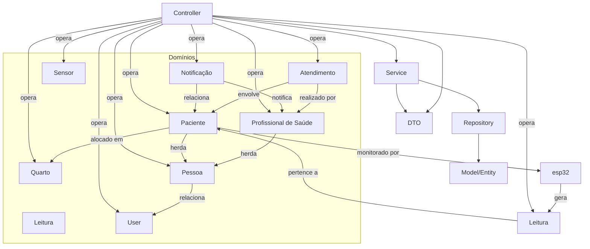

# Backend Monitoramento de Pacientes

## Sumário
- [Visão Geral do Projeto](#visão-geral-do-projeto)
- [Tecnologias Utilizadas](#tecnologias-utilizadas)
- [Arquitetura](#arquitetura)
  - [Camadas Principais](#camadas-principais)
  - [Boas Práticas Implementadas](#boas-práticas-implementadas)
  - [Diagrama da Arquitetura (Mermaid)](#diagrama-da-arquitetura-mermaid)
- [Regras de Negócio Aplicadas](#regras-de-negócio-aplicadas)
- [Integração com Dispositivos IoT (ESP32)](#integração-com-dispositivos-iot-esp32)
- [Diferenciais Técnicos](#diferenciais-técnicos)
- [Endpoints da API](#endpoints-da-api)
  - [Quarto](#quarto)
  - [Paciente](#paciente)
  - [Atendimento](#atendimento)
  - [Funcionário](#funcionário)
- [Como Executar o Projeto](#como-executar-o-projeto)
- [Sobre o Projeto](#sobre-o-projeto)

## Visão Geral do Projeto

O InfraMed é um sistema backend inovador, desenvolvido para otimizar a gestão hospitalar, reduzir a sobrecarga das equipes e agilizar o atendimento aos pacientes. Ele oferece uma API RESTful robusta para gerenciar dados de quartos, pacientes, atendimentos e funcionários de saúde, tornando o ambiente hospitalar mais eficiente, seguro e centrado no paciente. Com uma arquitetura moderna e princípios sólidos de engenharia de software, o InfraMed é a base tecnológica que devolve tempo aos profissionais e tranquilidade aos pacientes.

---
## Tecnologias Utilizadas
- **Java 24**
- **Spring Boot 3.4.5**
- **Spring Data JPA**
- **Hibernate**
- **Maven**
- **Lombok**
- **MySQL**
- **Jakarta Validation / Hibernate Validator**
---
## Arquitetura
O projeto adota uma arquitetura em camadas, organizada por domínios de negócio (quarto, paciente, atendimento, funcionário), cada um com suas próprias camadas de Controller, Service, Repository e Model. Essa estrutura modular segue princípios de **Domain-Driven Design (DDD)**, **SOLID**, **DRY** e **Clean Architecture**, promovendo separação de responsabilidades, manutenibilidade e escalabilidade.

### Camadas Principais
- **Controller:** Recebe e valida requisições HTTP, delega à camada de serviço e formata respostas.
- **Service:** Contém a lógica de negócio central, orquestra operações e aplica regras.
- **Repository:** Abstrai a persistência de dados, utilizando Spring Data JPA.
- **Model/Entity:** Define as entidades do domínio e o mapeamento para o banco de dados.
- **DTOs:** Transferem dados entre camadas, controlando exposição e recebimento de informações.

### Boas Práticas Implementadas
- **API RESTful** com verbos e URLs padronizadas
- **DTOs** para desacoplamento e segurança dos dados
- **Tratamento centralizado de exceções**
- **Validação de dados** com anotações
- **Injeção de dependência** via Spring
- **Padrões Repository e Service**
- **DDD, SOLID, DRY e Clean Code**

### Diagrama da Arquitetura (Mermaid)

O diagrama abaixo ilustra, de forma simplificada e didática, como a arquitetura do sistema está organizada. Ele mostra as principais camadas técnicas (Controller, Service, Repository, Model/Entity, DTO) e como elas se relacionam com os domínios do negócio (Paciente, Profissional de Saúde, Atendimento, Quarto, Sensor, Leitura, Notificação, User e Pessoa).

- **Controller:** Porta de entrada das requisições (ex: cadastrar paciente, buscar quarto). Recebe dados do usuário e envia para o Service.
- **Service:** Onde fica a lógica de negócio (ex: regras para alocar paciente, validar médico). Processa dados e chama o Repository.
- **Repository:** Responsável por salvar, buscar e atualizar dados no banco de dados.
- **Model/Entity:** Representa as "coisas" do sistema (Paciente, Quarto, etc.) e como são armazenadas.
- **DTO:** Objetos usados para transferir dados entre as camadas, garantindo segurança e clareza.

Os domínios representam os principais elementos do hospital, e as setas mostram como eles se relacionam (ex: um Paciente está em um Quarto, um Sensor gera Leituras para um Paciente, etc.).



> **Resumo visual:**
> - As camadas técnicas (Controller, Service, Repository, Model, DTO) organizam o fluxo de dados e regras.
> - Os domínios representam os principais elementos do hospital.
> - As setas mostram como tudo se conecta, facilitando a compreensão tanto para profissionais de TI quanto para leigos.

## Regras de Negócio Aplicadas

O sistema InfraMed implementa regras de negócio alinhadas ao modelo de dados e aos relacionamentos definidos no TAP, garantindo integridade, segurança e eficiência no ambiente hospitalar. As principais regras são:

### Usuários e Permissões
- Todo acesso ao sistema é feito por um **User**, que possui credenciais e permissões específicas.
- Apenas usuários autenticados podem acessar funcionalidades restritas conforme seu perfil (Profissional de Saúde, Administrador).

### Hierarquia de Entidades
- **Pessoa** é a base para **Paciente** e **Profissional de Saúde**, garantindo unicidade e integridade dos dados pessoais.
- Um **User** pode ser vinculado a uma **Pessoa**.

### Paciente
- Cada paciente deve ter dados pessoais completos e únicos (CPF, e-mail, etc.).
- Um paciente pode ser monitorado por um ou mais sensores.
- Um paciente deve estar alocado em um quarto durante a internação.
- O histórico médico e de internação do paciente é mantido e atualizado a cada atendimento ou evento relevante.

### Profissional de Saúde
- Cada profissional de saúde deve ter dados pessoais completos e únicos.
- Um profissional pode ser responsável por um ou mais pacientes.
- Apenas profissionais de saúde com o cargo de **médico** podem ser vinculados à abertura de um atendimento e realizar prescrições em caso de complicação.

### Quarto
- Cada quarto possui capacidade máxima definida e não pode exceder esse limite de ocupação.
- Um paciente só pode estar em um quarto por vez.

### Monitoramento
- Cada sensor/leitura é vinculado a um paciente e pode gerar múltiplas leituras.
- Leituras de sensores devem conter valor, data/hora e referência ao paciente/atendimento que o sensor for atribuido.
- Leituras anômalas podem gerar notificações automáticas como possível erro.

### Notificações
- Notificações são geradas automaticamente pelo sistema em caso de eventos críticos (ex: leitura fora do padrão, necessidade de intervenção médica).
- Notificações são sempre associadas a um paciente e a um ou mais profissionais de saúde responsáveis.

### Remoção e Atualização Segura
- Não é permitido remover pacientes, profissionais, quartos ou sensores vinculados a registros ativos (atendimentos, leituras, notificações).
- Alterações em dados sensíveis (CPF, e-mail, permissões) são validadas para evitar duplicidade e inconsistências.

Essas regras garantem a confiabilidade dos dados, a rastreabilidade dos eventos clínicos e a segurança das operações, alinhando o sistema às necessidades reais do ambiente hospitalar inteligente.

---
## Integração com Dispositivos IoT (ESP32)

O sistema está preparado para integração com dispositivos IoT, como o ESP32, que podem ser utilizados para monitoramento em tempo real de pacientes. Sensores conectados ao ESP32 podem enviar dados vitais (ex: batimentos cardíacos, temperatura, pressão) diretamente para a API via WebSocket ou HTTP, permitindo:
- Monitoramento contínuo e automatizado dos pacientes internados.
- Geração automática de alertas e notificações em caso de leituras anormais.
- Registro histórico de todas as leituras recebidas dos sensores.

Essa integração torna o sistema mais robusto, moderno e alinhado com as tendências de saúde conectada (IoT Healthcare), agregando valor tanto para profissionais quanto para pacientes.

---
## Diferenciais Técnicos
- **Modularidade e Escalabilidade**
- **Código limpo, testável e de fácil manutenção**
- **Robustez e confiabilidade**
- **Foco no domínio de negócio hospitalar**

---
## Endpoints da API

### Quarto
Base URL: `/api/quarto`

| Método | URL | Descrição |
|---|---|---|
| GET | `/` | Lista todos os quartos |
| GET | `/{id}` | Busca quarto por ID |
| POST | `/` | Cria novo quarto |
| PUT | `/{id}` | Altera quarto existente |
| DELETE | `/{id}` | Remove quarto |
| POST | `/inserir-varios` | Insere múltiplos quartos |
| PUT | `/{quartoId}/alocar-paciente/{pacienteId}` | Aloca paciente em um quarto |
| PUT | `/{quartoId}/remover-paciente/{pacienteId}` | Remove paciente de um quarto |

### Paciente
Base URL: `/api/pacientes`

| Método | URL | Descrição |
|---|---|---|
| POST | `/` | Cria novo paciente |
| GET | `/` | Lista todos os pacientes |
| GET | `/id/{id}` | Busca paciente por ID |
| GET | `/cpf/{cpf}` | Busca paciente por CPF |
| GET | `/nome/{nome}` | Busca pacientes por nome |
| PUT | `/{id}` | Altera paciente existente |
| DELETE | `/{id}` | Remove paciente |

### Funcionário
Base URL: `/api/funcionarios`

| Método | URL | Descrição |
|---|---|---|
| POST | `/` | Cria novo funcionário de saúde |
| GET | `/` | Lista todos os funcionários |
| GET | `/id/{id}` | Busca funcionário por ID |
| GET | `/cpf/{cpf}` | Busca funcionário por CPF |
| GET | `/nome/{nome}` | Busca funcionários por nome |
| PUT | `/{id}` | Altera funcionário existente |
| DELETE | `/{id}` | Remove funcionário |
|        |     |           |
### Atendimento
Base URL: `/api/atendimento`

| Método | URL | Descrição |
|---|---|---|
| POST | `/` | Cria novo atendimento |
| GET | `/` | Lista todos os atendimentos |
| GET | `/{id}` | Busca atendimento por ID |
| PUT | `/{id}` | Altera atendimento existente |
| DELETE | `/{id}` | Remove atendimento |

### Leitura
Base URL: `/api/atendimento/{atendimentoId}/leituras`

| Método | URL | Descrição         |
|---|---|-------------------|
| POST | `/` | Cria nova leitura |


*Obs.: Para evitar ambiguidades, recomenda-se usar `/cpf/{cpf}` e `/id/{id}` nos endpoints de busca por CPF e ID.*

---
## Como Executar o Projeto

1. **Pré-requisitos:**
   - JDK 24 ou superior
   - Maven 3.x
   - MySQL
2. **Clone o repositório:**
   ```bash
   git clone https://github.com/matheus05dev/BackendMonitoramentoPacientes
   cd BackendMonitoramentoPacientes
   ```
3. **Configure o banco de dados:**
   - Edite o arquivo `src/main/resources/application.properties` com as credenciais e URL do seu banco MySQL.
4. **Compile e execute o projeto:**
   ```bash
   mvn clean install
   mvn spring-boot:run
   ```
5. **Acesse a aplicação:**
   - O backend estará disponível em: [http://localhost:8080](http://localhost:8080)

6. **Para acessar documentação da API**
   - Acesse a documentação feita no swagger: [http://localhost:8080/swagger-ui/index.html](http://localhost:8080)
   - Documentação do Swagger com detalhes especificos dos endpoints e corpo das requisições e respostas em formato de JSON
---

## Sobre o Projeto

Este projeto foi desenvolvido como Trabalho de Conclusão de Curso (TCC) do curso Técnico de Desenvolvimento de Sistemas da Escola SENAI 403 "Antônio Ermírio de Moraes" de Alumínio-SP, em trabalho colaborativo de equipe. O objetivo é demonstrar domínio de arquitetura moderna, princípios de engenharia de software e foco em soluções reais para o setor de saúde, sendo ideal para portfólio profissional e inicio na área de desenvolvimento de software.