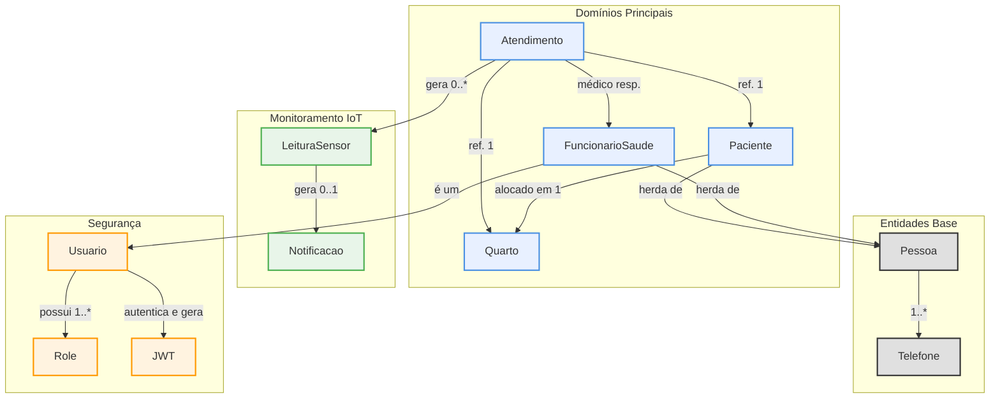

# InfraMed - API de Monitoramento de Pacientes

**API RESTful robusta para gestão hospitalar e monitoramento de pacientes em tempo real, construída com arquitetura moderna e as melhores práticas de desenvolvimento.**

---

<p align="center">
  
  
  
  
  
</p>

---

## 📋 Sumário

- [Sobre o Projeto](#-sobre-o-projeto)
- [✨ Principais Funcionalidades](#-principais-funcionalidades)
- [🛠️ Tecnologias e Justificativas](#-tecnologias-e-justificativas)
- [🏗️ Arquitetura do Sistema](#-arquitetura-do-sistema)
- [🚀 Como Executar](#-como-executar)
- [📄 Endpoints da API](#-endpoints-da-api)
- [💡 Contexto do Projeto](#-contexto-do-projeto)
- [✍️ Autor](#-autor)

---

## 📖 Sobre o Projeto

O **InfraMed** é um sistema backend projetado para otimizar a gestão de hospitais, reduzir a sobrecarga das equipes de saúde e agilizar o atendimento. A API RESTful permite gerenciar de forma eficiente os dados de quartos, pacientes, atendimentos e funcionários, criando um ambiente hospitalar mais seguro e centrado no paciente.

Com uma arquitetura moderna e princípios sólidos de engenharia de software, o InfraMed serve como uma base tecnológica que devolve tempo aos profissionais e tranquilidade aos pacientes.

---

## ✨ Principais Funcionalidades

- **Gestão Completa:** Operações CRUD para Pacientes, Funcionários, Quartos e Atendimentos.
- **Monitoramento IoT:** Arquitetura preparada para integração com dispositivos (como ESP32) para coleta de sinais vitais em tempo real.
- **Regras de Negócio Validadas:** Sistema de validações para alocação de pacientes, permissões de acesso e integridade dos dados.
- **Sistema de Notificações:** Alertas para eventos críticos, como leituras anormais de sensores, permitindo uma resposta rápida da equipe de saúde.
- **Segurança Robusta:** Autenticação baseada em JWT e autorização granular de acesso aos endpoints com base em perfis de usuário.
- **Documentação Interativa:** API documentada com Swagger (Springdoc) para facilitar testes e integração.

---

## 🛠️ Tecnologias e Justificativas

A escolha das tecnologias foi orientada para construir um sistema robusto, escalável e de fácil manutenção:

- **Java 24:** Utilização da versão mais recente do Java para aproveitar os últimos recursos de performance e segurança da linguagem.
- **Spring Boot 3.4.5:** Framework principal que acelera o desenvolvimento, com injeção de dependências, auto-configuração e um ecossistema completo.
- **Spring Data JPA & Hibernate:** Para persistência de dados, abstraindo a complexidade do acesso ao banco de dados e facilitando operações CRUD.
- **Spring Security:** Implementação de um sistema de segurança robusto, com autenticação via JWT e autorização baseada em roles.
- **Maven:** Gerenciador de dependências que garante a consistência do projeto e facilita o build.
- **Lombok:** Reduz a verbosidade do código, automatizando a criação de getters, setters e construtores.
- **MySQL:** Banco de dados relacional escolhido pela sua confiabilidade, performance e ampla aceitação no mercado.
- **JWT (JSON Web Token):** Para uma autenticação stateless, segura e escalável, ideal para APIs RESTful.
- **MapStruct:** Simplifica a conversão entre DTOs e entidades, reduzindo código boilerplate e possíveis erros.
- **Springdoc (Swagger):** Gera documentação interativa da API, facilitando a visualização e o teste dos endpoints.
- **Jakarta Validation / Hibernate Validator:** Garantia da integridade dos dados na camada de entrada da aplicação, antes de chegar à lógica de negócio.

---

## 🏗️ Arquitetura do Sistema

O projeto adota uma **arquitetura em camadas** com princípios de **Domain-Driven Design (DDD)**, **SOLID** e **Clean Architecture**. A organização por domínios de negócio (quarto, paciente, etc.) promove baixo acoplamento e alta coesão.

### Diagrama de Entidades

Para uma compreensão visual da estrutura de dados e dos relacionamentos entre as entidades do sistema, consulte o diagrama abaixo:



---

## 🚀 Como Executar

1.  **Pré-requisitos:**
    *   JDK 24 ou superior
    *   Maven 4.0.0
    *   MySQL 8.0
2.  **Clone o repositório:**
    ```bash
    git clone https://github.com/matheus05dev/BackendMonitoramentoPacientes
    cd BackendMonitoramentoPacientes
    ```
3.  **Configure o banco de dados:**
    *   No seu MySQL, crie um schema (ex: `inframed_db`).
    *   Edite o arquivo `src/main/resources/application.properties` com suas credenciais do banco.
4.  **Compile e execute:**
    ```bash
    mvn clean install
    mvn spring-boot:run
    ```
5.  **Acesse a aplicação:**
    *   **Backend:** [http://localhost:8080](http://localhost:8080)
    *   **Documentação Swagger:** [http://localhost:8080/swagger-ui/index.html](http://localhost:8080/swagger-ui/index.html)
6.  **Simulador IoT (Opcional):**
    *   Para testar o envio de dados dos sensores, utilize o simulador em Python disponível [neste repositório](https://github.com/matheus05dev/SimuladorIoTMonitoramentoPacientes).

---

## 📄 Endpoints da API

A API está organizada por recursos e utiliza um sistema de perfis (`Role`) para controlar o acesso.

<details>
<summary>Perfis de Usuário (Roles)</summary>

| Role | Descrição |
|---|---|
| `ADMIN` | Acesso total ao sistema, incluindo gerenciamento de usuários e configurações. |
| `MEDICO` | Acesso a funcionalidades de atendimento, diagnóstico e gerenciamento de pacientes. |
| `ENFERMEIRO` | Acesso a funcionalidades de cuidado ao paciente, alocação em quartos e monitoramento. |
| `AUXILIAR_ENFERMAGEM` | Acesso limitado a tarefas de suporte e consulta de informações. |
| `TECNICO_ENFERMAGEM` | Acesso a tarefas técnicas, como coleta de dados e monitoramento. |
| `ESTAGIARIO` | Acesso de leitura para aprendizado e observação. |
| `ANY` | Acessível por qualquer usuário autenticado. |
| `PUBLIC` | Acessível publicamente, sem necessidade de autenticação. |

</details>

<details>
<summary>Endpoints Disponíveis</summary>

### Autenticação
Base URL: `/api/auth`

| Método | URL | Descrição | Role |
|---|---|---|---|
| POST | `/login` | Autentica um usuário e retorna um token JWT. | `PUBLIC` |

### Quarto
Base URL: `/api/quarto`

| Método | URL | Descrição | Role |
|---|---|---|---|
| GET | `/` | Lista todos os quartos. | `ANY` |
| GET | `/{id}` | Busca um quarto por ID. | `ANY` |
| POST | `/` | Cria um novo quarto. | `ADMIN` |
| PUT | `/{id}` | Altera um quarto existente. | `ADMIN` |
| DELETE | `/{id}` | Remove um quarto. | `ADMIN` |
| PUT | `/{quartoId}/alocar-paciente/{pacienteId}` | Aloca um paciente a um quarto. | `ADMIN`, `MEDICO`, `ENFERMEIRO` |
| PUT | `/{quartoId}/remover-paciente/{pacienteId}` | Remove um paciente de um quarto. | `ADMIN`, `MEDICO`, `ENFERMEIRO` |

### Paciente
Base URL: `/api/pacientes`

| Método | URL | Descrição | Role |
|---|---|---|---|
| POST | `/` | Cria um novo paciente. | `ADMIN`, `MEDICO`, `ENFERMEIRO` |
| GET | `/` | Lista todos os pacientes. | `ANY` |
| GET | `/id/{id}` | Busca um paciente por ID. | `ANY` |
| GET | `/cpf/{cpf}` | Busca um paciente por CPF. | `ANY` |
| GET | `/nome/{nome}` | Busca pacientes por nome. | `ANY` |
| PUT | `/{id}` | Altera um paciente existente. | `ADMIN`, `MEDICO`, `ENFERMEIRO` |
| DELETE | `/{id}` | Remove um paciente. | `ADMIN` |

### Funcionário
Base URL: `/api/funcionario`

| Método | URL | Descrição | Role |
|---|---|---|---|
| POST | `/` | Cria um novo funcionário. | `ADMIN` |
| GET | `/` | Lista todos os funcionários. | `ANY` |
| GET | `/{id}` | Busca um funcionário por ID. | `ANY` |
| GET | `/buscar-por-nome/{nome}` | Busca funcionários por nome. | `ANY` |
| GET | `/buscar-por-cpf/{cpf}` | Busca um funcionário por CPF. | `ANY` |
| PUT | `/{id}` | Altera um funcionário existente. | `ADMIN` |
| DELETE | `/{id}` | Remove um funcionário. | `ADMIN` |

### Atendimento
Base URL: `/api/atendimento`

| Método | URL | Descrição | Role |
|---|---|---|---|
| POST | `/` | Cria um novo atendimento. | `ADMIN`, `MEDICO` |
| GET | `/` | Lista todos os atendimentos. | `ANY` |
| GET | `/{id}` | Busca um atendimento por ID. | `ANY` |
| PUT | `/{id}` | Altera um atendimento existente. | `ADMIN`, `MEDICO` |
| DELETE | `/{id}` | Remove um atendimento. | `ADMIN` |

### Leitura de Sensores
Base URL: `/api/leituras`

| Método | URL | Descrição | Role |
|---|---|---|---|
| POST | `/atendimento/{atendimentoId}` | Cria uma nova leitura de sensor. | `PUBLIC` |
| GET | `/atendimento/{atendimentoId}` | Lista as leituras de um atendimento. | `ANY` |

### Notificações
Base URL: `/api/notificacoes`

| Método | URL | Descrição | Role |
|---|---|---|---|
| PUT | `/{id}/fechar` | Fecha uma notificação de alerta. | `ANY` |
| GET | `/` | Lista todas as notificações. | `ANY` |

</details>

---

## 💡 Contexto do Projeto

Este projeto foi desenvolvido como Trabalho de Conclusão de Curso (TCC) do curso Técnico de Desenvolvimento de Sistemas da Escola SENAI 403 "Antônio Ermírio de Moraes". O objetivo foi aplicar conceitos de arquiteturas modernas e engenharia de software na criação de uma solução relevante para o setor de saúde.

---

## ✍️ Autor

**Matheus Nunes da Silva**

- **GitHub:** [https://github.com/matheus05dev](https://github.com/matheus05dev)

---
