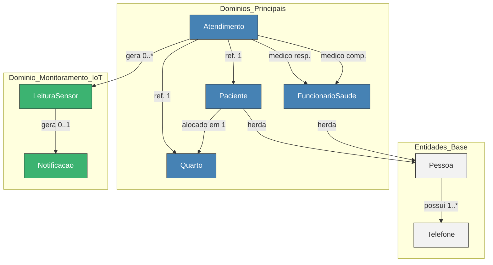

# InfraMed - API de Monitoramento de Pacientes

**Um sistema backend robusto para otimizar a gestão hospitalar, monitorar pacientes em tempo real e agilizar o atendimento, construído com as melhores práticas de arquitetura de software.**

---

<p align="center">
  
  
  
  
  
</p>

---

## 📋 Sumário

- [Sobre o Projeto](#-sobre-o-projeto)
- [✨ Principais Funcionalidades](#-principais-funcionalidades)
- [🛠️ Tecnologias Utilizadas](#-tecnologias-utilizadas)
- [🏗️ Arquitetura do Sistema](#-arquitetura-do-sistema)
- [🚀 Como Executar](#-como-executar)
- [📄 Endpoints da API](#-endpoints-da-api)
- [💡 Contexto](#-contexto)

---

## 📖 Sobre o Projeto

O **InfraMed** é um sistema backend inovador, desenvolvido para otimizar a gestão hospitalar, reduzir a sobrecarga das equipes e agilizar o atendimento aos pacientes. Ele oferece uma API RESTful robusta para gerenciar dados de quartos, pacientes, atendimentos e funcionários de saúde, tornando o ambiente hospitalar mais eficiente, seguro e centrado no paciente.

Com uma arquitetura moderna e princípios sólidos de engenharia de software, o InfraMed é a base tecnológica que devolve tempo aos profissionais e tranquilidade aos pacientes.

---

## ✨ Principais Funcionalidades

- **Gestão Completa:** CRUD para Pacientes, Funcionários, Quartos e Atendimentos.
- **Monitoramento IoT:** Preparado para integração com dispositivos (como ESP32) para coleta de sinais vitais em tempo real.
- **Regras de Negócio:** Validações para alocação de pacientes, permissões de funcionários e integridade dos dados.
- **Notificações:** Sistema de alertas para eventos críticos, como leituras anormais de sensores.
- **Segurança:** Tratamento de exceções, validação de dados e uso de DTOs para proteger a integridade das entidades.
- **Documentação:** API documentada com Swagger para facilitar o uso e os testes.

---

## 🛠️ Tecnologias Utilizadas

- **Java 24**
- **Spring Boot 3.4.5**
- **Spring Data JPA** & **Hibernate**
- **Maven**
- **Lombok**
- **MySQL**
- **Jakarta Validation** / **Hibernate Validator**

---

## 🏗️ Arquitetura do Sistema

O projeto adota uma arquitetura em camadas, organizada por domínios de negócio (quarto, paciente, etc.), seguindo princípios de **Domain-Driven Design (DDD)**, **SOLID**, e **Clean Architecture**.

Abaixo está um diagrama que ilustra o relacionamento entre as principais entidades do sistema, refletindo a estrutura do banco de dados e as regras de negócio.

### Diagrama de Entidades



---

## 🚀 Como Executar

1.  **Pré-requisitos:**
    *   JDK 24 ou superior
    *   Maven 3.x
    *   MySQL
2.  **Clone o repositório:**
    ```bash
    git clone https://github.com/matheus05dev/BackendMonitoramentoPacientes
    cd BackendMonitoramentoPacientes
    ```
3.  **Configure o banco de dados:**
    *   Edite o arquivo `src/main/resources/application.properties` com as credenciais do seu banco MySQL.
4.  **Compile e execute:**
    ```bash
    mvn clean install
    mvn spring-boot:run
    ```
5.  **Acesse a aplicação:**
    *   Backend: [http://localhost:8080](http://localhost:8080)
    *   Documentação Swagger: [http://localhost:8080/swagger-ui/index.html](http://localhost:8080/swagger-ui/index.html)
6.  **Simulador IoT:**
    *   Para testar o envio de dados dos sensores, utilize o simulador em Python disponível [neste repositório](https://github.com/matheus05dev/SimuladorIoTMonitoramentoPacientes).

---

## 📄 Endpoints da API

<details>
<summary>Clique para ver os endpoints</summary>

### Quarto
Base URL: `/api/quarto`

| Método | URL | Descrição |
|---|---|---|
| GET | `/` | Lista todos os quartos |
| GET | `/{id}` | Busca quarto por ID |
| POST | `/` | Cria novo quarto |
| PUT | `/{id}` | Altera quarto existente |
| DELETE | `/{id}` | Remove quarto |

### Paciente
Base URL: `/api/pacientes`

| Método | URL | Descrição |
|---|---|---|
| POST | `/` | Cria novo paciente |
| GET | `/` | Lista todos os pacientes |
| GET | `/id/{id}` | Busca paciente por ID |
| GET | `/cpf/{cpf}` | Busca paciente por CPF |

### Funcionário
Base URL: `/api/funcionarios`

| Método | URL | Descrição |
|---|---|---|
| POST | `/` | Cria novo funcionário |
| GET | `/` | Lista todos os funcionários |
| GET | `/id/{id}` | Busca funcionário por ID |

### Atendimento
Base URL: `/api/atendimento`

| Método | URL | Descrição |
|---|---|---|
| POST | `/` | Cria novo atendimento |
| GET | `/` | Lista todos os atendimentos |
| GET | `/{id}` | Busca atendimento por ID |

### Leitura
Base URL: `/api/leituras`

| Método | URL | Descrição |
|---|---|---|
| POST | `/atendimento/{atendimentoId}` | Cria nova leitura |
| GET | `/atendimento/{atendimentoId}` | Lista leituras por atendimento |

### Notificações
Base URL: `/api/notificacoes`

| Método | URL | Descrição |
|---|---|---|
| PUT | `/{id}/fechar` | Fecha uma notificação de alerta |
| GET | `/` | Lista todas as notificações |

</details>

---

## 💡 Contexto

Este projeto foi desenvolvido como Trabalho de Conclusão de Curso (TCC) do curso Técnico de Desenvolvimento de Sistemas da Escola SENAI 403 "Antônio Ermírio de Moraes" de Alumínio-SP. O objetivo é demonstrar o domínio de arquiteturas modernas e a aplicação de engenharia de software em soluções para o setor de saúde.

---
